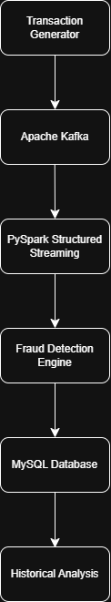
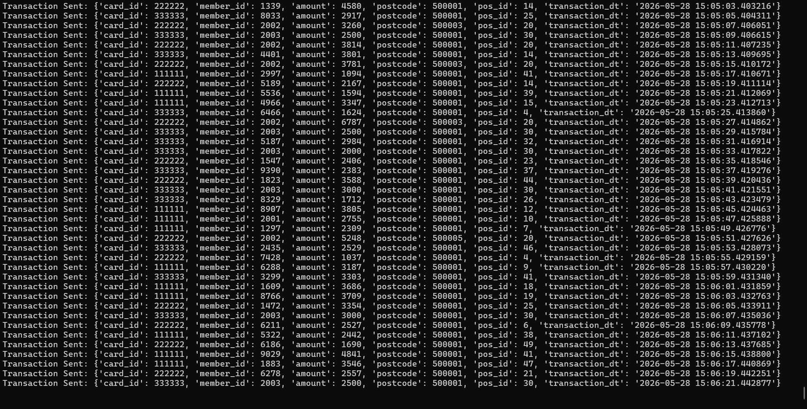
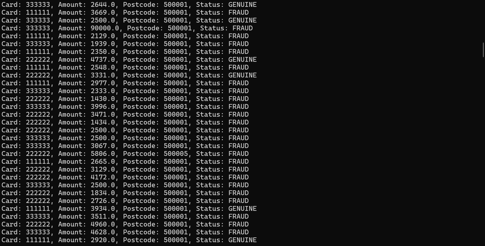
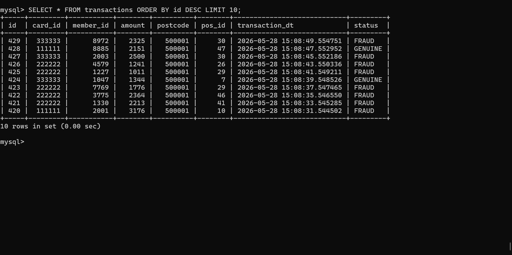

# Real-Time Credit Card Fraud Detection System

## Overview

This project is a real-time credit card fraud detection system built using Apache Kafka, PySpark Structured Streaming, and MySQL.

The main objective of the project is to simulate how banking systems process live transaction streams and identify suspicious activities using behavioral fraud detection techniques.

The system continuously generates transaction data, streams it through Kafka, processes it using Spark Structured Streaming, applies fraud detection rules, and stores the results in MySQL for historical analysis.

---

## Technologies Used

* Apache Kafka
* Apache Spark
* PySpark Structured Streaming
* MySQL
* Python
* WSL (Ubuntu)

---

## Project Workflow

Transaction Generator
→ Kafka Producer
→ Kafka Topic
→ Spark Structured Streaming
→ Fraud Detection Engine
→ MySQL Database

---

## Architecture Diagram 



---

## Fraud Detection Rules

### 1. Rapid Transaction Fraud

Detects repeated usage of the same card within a short time period.

### 2. Location Fraud

Detects suspicious distant postcode changes for the same card.

### 3. Spending Spike Fraud

Detects unusually high spending compared to the user's historical average spending pattern.

### 4. Night-Time Fraud

Detects suspicious high-value transactions during unusual hours.

---

## Features

* Real-time transaction streaming using Kafka
* Fraud detection using PySpark Structured Streaming
* Historical transaction analysis using MySQL
* Behavioral fraud detection rules
* Real-time fraud status generation
* Synthetic transaction simulation
* Stateful streaming pipeline

---

## Project Structure

```text
fraud-project-linux/
│
├── producer/
│   └── transaction_producer.py
│
├── streaming/
│   └── fraud_detection_stream.py
│
├── screenshots/
├── architecture/
├── sql/
├── docs/
├── requirements.txt
├── README.md
└── .gitignore
```

---

## Setup Instructions

### 1. Start ZooKeeper

```bash
bin/zookeeper-server-start.sh config/zookeeper.properties
```

### 2. Start Kafka Server

```bash
bin/kafka-server-start.sh config/server.properties
```

### 3. Start Transaction Producer

```bash
python producer/transaction_producer.py
```

### 4. Start Streaming Fraud Detection Engine

```bash
python streaming/fraud_detection_stream.py
```

---

## Screenshots

### Kafka Producer Output



### Spark Streaming Fraud Detection Output



### MySQL Transaction Storage



---

## Future Improvements

* HBase integration for faster historical lookup
* Hive integration for analytical reporting
* Machine Learning-based fraud prediction
* Dashboard visualization using Power BI or Tableau
* Integration with real banking datasets

---

## Learning Outcomes

Through this project, I learned:

* Real-time data streaming concepts
* Kafka producer-consumer architecture
* Spark Structured Streaming
* Stateful fraud detection logic
* Historical transaction analysis
* Database integration with MySQL
* End-to-end data engineering workflow

---

## Author

Rohit
